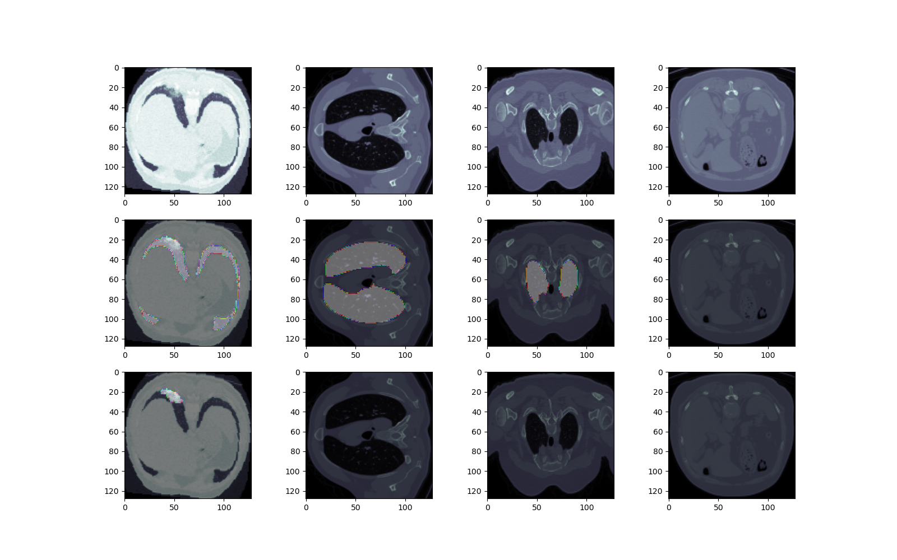
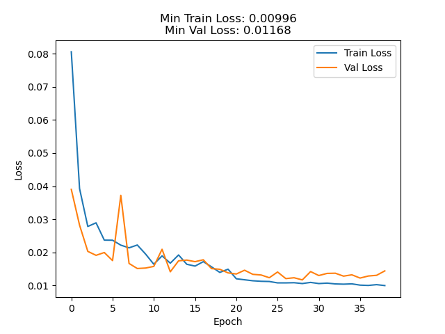
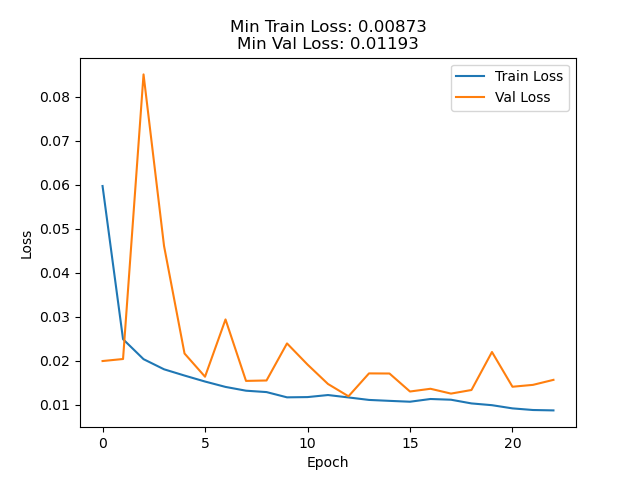
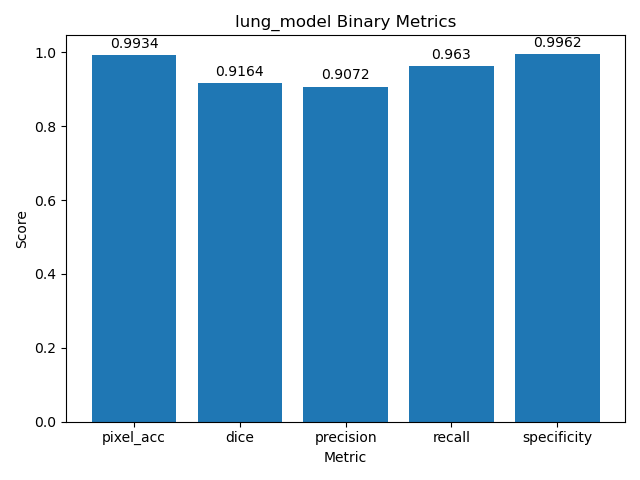
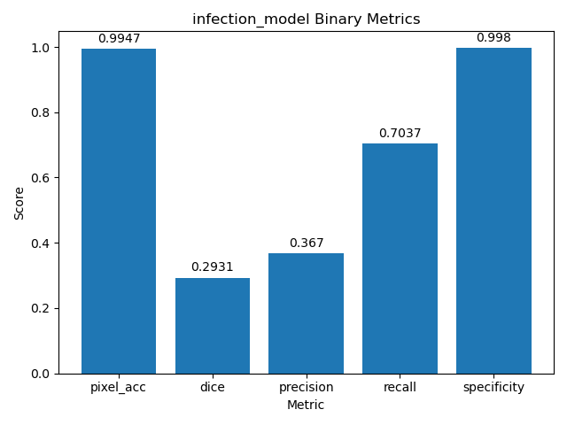
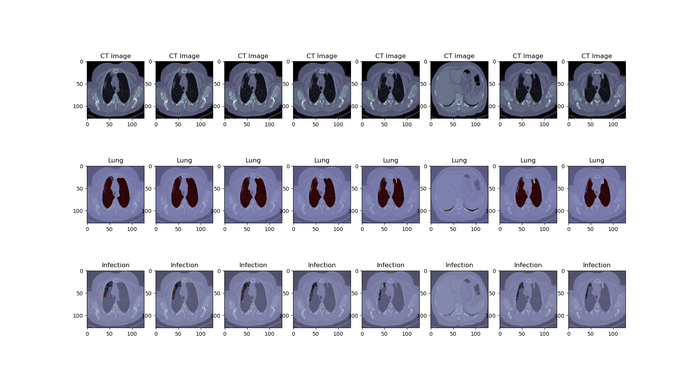
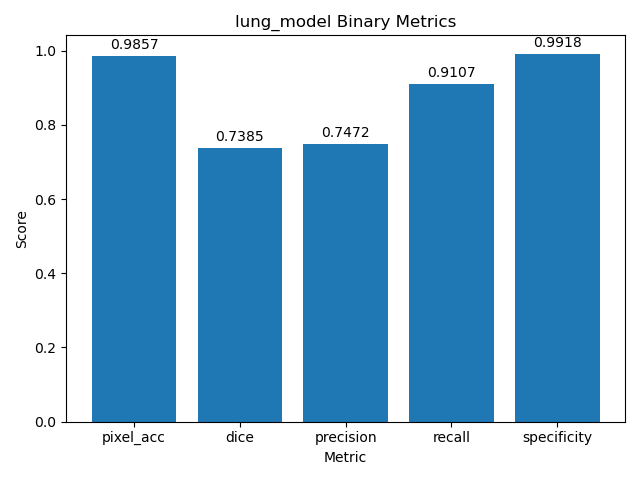
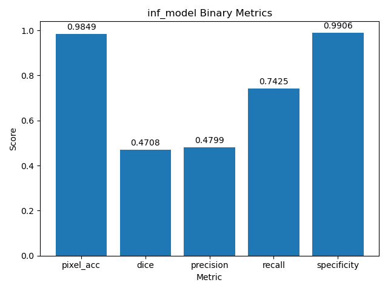
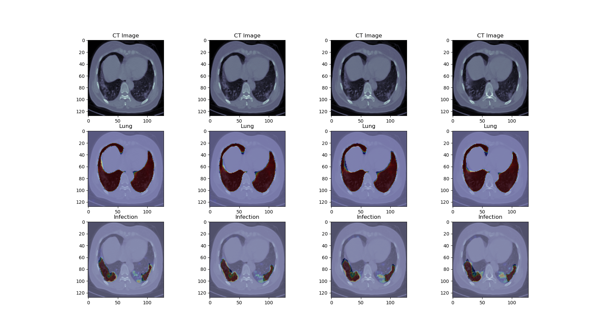

# COVID-19 CT Detection with ResUnet
[Kaggle Data Link](https://www.kaggle.com/andrewmvd/covid19-ct-scans)

## Description
This is a personal project to learn about segmentation models. 

**This codebase has not been operationalized for common use.**

The dataset includes 20 CT Volumes from MRI scans of patient lungs infected by COVID-19, hand labeled by medical experts. I do not know details, but the scans look to be half and half from two different systems based on the different filenames and differing data distributions.

The Kaggle site described two separate tasks as part of this project:
1. Detect/segment the lungs within each slice of the volumes
2. Detect/segment the infected areas in each slice of the volumes

## My Approach
I utilized the Residual-Unet model architecture implemented [by this repo](https://github.com/rishikksh20/ResUnet/blob/master/core/res_unet.py) for this task.

A "Lung Model" and "Infection Model" each were trained on a single 6GB NVIDIA GeForce RTX 1660 Super (the low memory is of course a limiting factor in performance). The original slices were 512x512 resolution, but I was forced to reduce this to 128x128 to avoid OOM errors at a reasonable batch size.

Two tricks I implemented to increase performance of the infection model:
- Stacking the raw CT slice with the prediction from the lung model to provide additional information to the infection model, which did boost performance slightly.
- Each of the slices contain a large area of empty space. With some thresholding/smoothing/binary dilation a region of interest could be consistently cropped and extracted to exclude the empty space and feed the models only the necessary area of each slice, also slightly helping performance.
    - See crop_roi.ipynb to visualizations of this process

**Final Training Sample With Augmentations**

## Training Results

## Validation Results

## Test Results

As you can see, still some work to be done. Another approach I tried was "patching" the slices into quadrants to further zoom on the data, but this actually performed worse. Thanks for reading!

